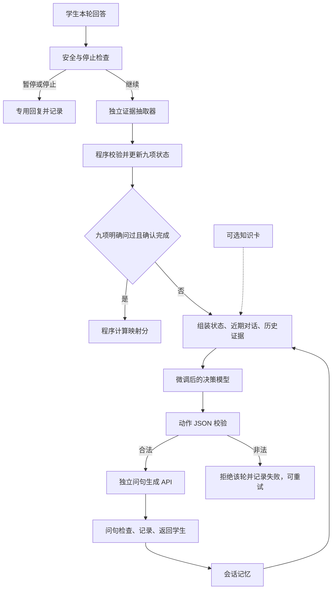

# D4 决策模型训练方案

日期：2026-09-30。状态：设计方案，尚未开始预处理、补标或训练。以 C 项目 `/api/assessment` 的九项测评为目标；问句生成继续使用独立 API。

## 1. 推荐路线

主模型选 `Qwen/Qwen3-4B-Instruct-2507`，以 LoRA／QLoRA 做监督微调，学习「本轮学生回答＋历史＋逐项状态 → 下一步提问动作」。先建立未经微调的同模型基线和当前 API 决策器基线，再决定微调是否值得替换现有决策器。

D4 是训练素材和主题预测基准；完整项目动作需要补标。第一版使用会话内结构化记忆；条目定义放在固定提示中；扩展知识卡作为可选对照，不先建设向量知识库或跨用户经验检索。

当前目标是完整覆盖九项并逐项确认，不以减少必问条目为优化目标。D4 医生的实际下一问是一个示范动作，不天然等于唯一最优动作。

## 2. 已核查的依据

- 本地数据：`C:\Users\lvmingqiang\Downloads\D4`，包含 train 1056、val 151、test 132 段对话。
- 每段有 `log`、`portrait`、`record`；`log` 包含 `speaker/text/action/topic`。医生 `action` 是主题性标签，如睡眠、兴趣、食欲，也有共情安慰、其它等。
- 本地版本共 11 种非空医生 action 标签；医生消息 40091 条，其中 161 条没有 action。消息不是独立对话或可直接训练的有效决策点；必须合并角色连续消息并筛选。
- 年龄字段统计：12～18 岁画像 131 段，18 岁以上 1201 段，12 岁以下 7 段。画像年龄不能证明模拟扮演者年龄；青少年画像子集也不等于真实学生验证集。
- 官方论文与本地数据的「轮数」统计单位不同，不能把原始消息条数当作论文的轮数。
- 当前项目 `QuestionAction` 输出四字段，intent 有五类；`DecisionContext` 提供本轮回答、证据、九项状态和最近对话；运行时尚未读取睡眠卡。
- 当前 `EvidenceCandidate` 没有「含义是否明确」字段；部分模糊回答可能在决策前就确认条目。因此增加 `clarify_meaning` 必须同时处理证据抽取和确认条件。

以上数据审计只用于适配；不把患者画像、最终诊断或完整摘要提供给决策模型作为已知信息。

## 3. 值得参考的 D4 论文

| 论文 | 已核对内容 | 对我们有用的部分 | 适用边界 |
| --- | --- | --- | --- |
| [D4，EMNLP 2022](https://aclanthology.org/2022.emnlp-main.156/)；[官方代码](https://github.com/BigBinnie/D4_baseline) | 包含主题预测和回复生成；主题可作为生成的条件。 | 数据字段、预处理、原始主题任务基线。 | 主题标签不是我们的九项＋细粒度 intent；不能把其 topic accuracy 当本项目动作准确率。 |
| [POST：Enhancing Depression-Diagnosis-Oriented Chat with Psychological State Tracking](https://arxiv.org/html/2403.09717v2)；[NLPCC 2025 章节](https://link.springer.com/chapter/10.1007/978-981-95-3349-7_9) | 在 D4 上补标 Stage、Information、Summary、Next，用 LoRA 训练状态与回复生成。 | 最接近「动态状态 → 下一步策略 → 表达」；参考逐轮补标和人工复核。 | 论文联合训练状态和回复，我们保留独立接口；其诊断摘要和 ABC 阶段不能直接当 PHQ-A 状态。 |
| [AMC：Depression Diagnosis Dialogue Simulation: Self-improving Psychiatrist with Tertiary Memory，2024 预印本](https://arxiv.org/html/2409.15084v2) | 使用 D4，研究对话记录、电子病历、诊断技能三层记忆及反思。 | 参考记忆分工、模拟回合测试与记忆消融。 | 主要研究不改模型权重的代理系统；不能当作 D4 决策器微调成绩或本项目临床效度证据。 |

阅读顺序：先 D4 原始格式，再 POST 的逐轮状态和 Next 标注，最后 AMC 的记忆设计。原论文方法提供设计参考，不保证迁移到本项目后有效。

## 4. 训练模型与起始配置

| 用途 | 选择 | 理由 |
| --- | --- | --- |
| 主决策器 | `Qwen/Qwen3-4B-Instruct-2507` | 中文指令模型，4B，非思考模式，适合短结构化输出；不是宣称它在 D4 上最好。 |
| 便宜的主题任务对照 | `hfl/chinese-roberta-wwm-ext`＋分类头 | 可以检验 D4 原始主题标签是否可学；不承担完整四字段动作输出。 |
| 当前强基线 | 项目现有 API 决策器 | 衡量训练收益及速度、成本取舍；与微调模型使用同一状态和动作词表。 |
| 问句生成 | 现有独立 API | 比较决策器时固定生成器、提示、温度和版本，减少混杂因素。 |

模型依据：[Qwen 官方模型卡](https://huggingface.co/Qwen/Qwen3-4B-Instruct-2507)、[HFL 官方模型页](https://huggingface.co/hfl/chinese-roberta-wwm-ext)。

算力尚未确定，先按单张约 24 GB 显存 GPU 的 QLoRA 试验预算设计；实际峰值显存要用小批量实测。显存充足可用 BF16 LoRA，显存不足先缩短上下文、减小微批量，不承诺未经测量的训练耗时。

推荐起始值（工程起点，需验证集选择）：

- 4-bit NF4 基座＋LoRA；硬件支持时使用 BF16 计算；梯度检查点。
- LoRA `r=16`、`alpha=32`、`dropout=0.05`，作用于 transformer 线性层。
- 最大输入输出总长度先 4096 tokens；先统计真实长度分布，保留本轮回答、九项状态和关键证据。
- 微批量 1～2，梯度累积到有效 batch 16；学习率起点 `1e-4`，可对照 `5e-5`；最多 1～3 epoch，按验证动作指标选 checkpoint。
- 只对目标动作 JSON 的 tokens 计算损失；输入历史不计损失。核对 chat template 的 assistant mask，不能只设置参数却不检查掩码。
- 不训练长推理链；`reason` 保留一句能由状态核对的简短理由。
- 工具链：Transformers＋PEFT＋TRL；锁定实际测试通过的依赖与模型 revision。

方法实现参考：[PEFT 量化及 QLoRA](https://huggingface.co/docs/peft/developer_guides/quantization)、[TRL SFTTrainer](https://huggingface.co/docs/trl/sft_trainer)。第一版采用监督模仿；D4 没有我们所需的交互奖励，暂不做 PPO、GRPO 或把它包装为强化学习。

## 5. 先确定动作与状态契约

保留决策模型选择条目与意图的职责。建议在现有五类上增加通用 `clarify_meaning`，并把输入里的时间、频率、含义缺口显式化。这是待实施的 v2 设计；当前代码仍为 v1。

| intent | 具体任务 | 建议的状态前提 |
| --- | --- | --- |
| `open_topic` | 明确开启一个主题 | 未明确问过；条目仍开放。 |
| `confirm_mention` | 确认学生主动提及的主题 | 有本人的证据且尚需确认；不能用空泛提及替代完成。与 open_topic 有重叠时保留多个可接受动作供评测。 |
| `clarify_meaning`（新增） | 弄清学生的话是否、如何对应条目 | 已问过，本人原话可溯源，记录了含义缺口。未问过的主动提及可先用 confirm_mention。 |
| `clarify_period` | 核对是否属于过去两周 | 已问过，有明确的未知或其他时间窗。 |
| `clarify_frequency` | 让学生确认四档频率 | 已问过，含义与时间窗充分，频率未确认。 |
| `resolve_conflict` | 处理与既有回答的矛盾 | 已记录冲突及证据，不直接覆盖旧分值。 |

重要的代码前置工作：

1. `models.py`、抽取候选和 `DecisionContext.payload()` 一起明确含义、时间和频率的状态；`unknown` 不补成已知。
2. 抽取器判断含义仍是模型或人工的语义判断。程序能核对引用、枚举、状态条件，但不能把这些检查说成临床理解的证明。
3. 含义未明时保留条目开放；否则它会先被确认关闭，决策器再好也问不到它。
4. 更新动作枚举、提示词、validator、契约与验收案例；保证训练、评测、部署用同一版本。
5. 安全暂停、停止与九项完成由现有程序路径处理；普通提问动作不新增诊断、分值、任意结束等输出。

## 6. D4 预处理必须做什么

**A. 保持原始文件只读。** 在不提交 Git 的受控训练目录保存派生数据。记录文件哈希、脚本版本、过滤原因与样本计数。用 UTF-8 读写并检查控制字符，不删除否定、时间、频率等词。

**B. 先固定拆分再切样本。** 保留官方 train／val／test 的对话归属；同一对话的所有前缀和改写进入同一 split。检查跨 split 的重复或同源画像，若发现泄漏，单列重分组版本及与官方拆分的差异，不静默改变基准。

**C. 合并连续角色消息并选决策边界。** 通常以患者连续消息结束、医生回复开始的位置为一个决策点。纯寒暄、纯安慰、诊断或用药建议保留在历史中，但不强行标成项目的提问动作。医生一轮有多个问题、多个主题或安慰后再问时，标记多动作；优先人工筛选出能支持一个明确动作的样本，不照搬「最后一个 topic」规则后声称精细决策准确。

**D. 分清字段。** `action` 是医生主题标签；`topic` 常为空或是额外标注列表，不能把它作为完整分类标签，更不能序列化整个列表后误当标签字符串。

**E. 防止未来信息泄漏。** 输入只包含该决策点之前的对话和本轮学生回答。后续医生问句用于标注动作，不能进入输入、状态摘要或证据。`portrait.symptoms/drisk/srisk` 和 `record.summary/drisk/srisk` 不进入决策器输入；age 仅在模拟部署确实已知时提供。

**F. 按含义映射标签。** 睡眠可对应 `item_03`，兴趣可对应 `item_02`，食欲可对应 `item_04`，仍要核对医生实际问句。精神状态、躯体症状等可能覆盖多项，不能靠标签名强行一对一映射。共情、社会功能、筛查及其它也不是额外 PHQ-A 条目。

**G. 逐轮重建状态。** 从对话前缀中标出：问过哪些项、本人证据、时间是否明确、频率是否选档、是否冲突、含义是否明确。D4 没问过去两周时保留未知，不能为适应代码统一填 `past_14_days`。症状被提及不等于该项完成。

**H. 补标 intent。** 先做 200～300 个决策点的人工试标，用于校准规则；标注目标条目、intent、证据片段、缺口、可接受替代动作及标注质量。再扩至约 1000～3000 个经过复核的训练点，数量随学习曲线调整，不能预先保证全部 D4 都适用。争议与少数动作优先复核。

**I. 补目标场景案例。** D4 无法自然覆盖的四档确认、九项未完成、主动提及但未问、含义歧义、前后冲突，另外写成明确标记的合成案例。案例的历史和状态必须一致；不能只改状态开关而保留矛盾历史。真实 D4 衍生数据与合成数据分别报告结果。

许可约束：[D4 官网](https://x-lance.github.io/D4/)列出研究用途与不可分享要求。派生对话、模型上传及比赛对外展示应以已签 DUA 为准；本方案不把原始 D4 上传给外部 API 自动标注。若使用模型辅助标注，优先在获准的本地环境内执行并人工复核。

## 7. 训练与评测分两条任务线

### 7.1 D4 原始主题预测：先验证数据流程

输入 D4 历史及患者本轮回答，输出其原始主题。原始 11 标签与论文重组的类别要分开命名和报告。训练一个中文编码器分类基线，或让 Qwen 输出短主题 JSON；报告准确率、macro-F1、逐类召回和混淆矩阵。

这一步可以快速发现切分、标签和对齐问题，但不能把结果当作完整 PHQ-A 策略模型。此处学到的是示范对话的主题选择。

### 7.2 项目动作预测：实际接入的目标

使用补标后的 PHQ-A 兼容样本，输入部署同构的状态，输出本项目动作 JSON。主实验是 Qwen 直接在这些目标样本上 SFT；可额外比较「先做 D4 主题训练、再做目标动作 SFT」是否改善，主题预训练不是默认有效。

验证集用于选 checkpoint、超参数、知识卡和提示。测试集只在方案冻结后使用；测试对话不进入检索库、示例、标注提示或合成改写池。

| 比较组 | 内容 | 要回答的问题 |
| --- | --- | --- |
| A | 当前 API 决策器，统一成 v2 状态与动作提示 | 现有方案的水平怎样？ |
| B | Qwen 4B 未微调，同一提示 | 换基座本身有何影响？ |
| C | Qwen 4B 目标动作 SFT | 微调是否改善动作选择？ |
| D（可选） | D4 主题适配 → 同一目标动作 SFT | 原始主题数据是否有迁移收益？ |
| E | C 加条目知识卡，其余固定 | 运行时知识是否有额外价值？ |

初轮先完成 A/B/C；资源允许再做 D/E。比较知识卡时训练数据不变；若进一步做「训练时也有卡」实验，单列新组，避免同时改多个条件。

动作评测必须包括：

- 条目和 intent 各自 macro-F1；条目＋intent 联合正确率；人工标记的可接受动作集合命中率。
- 原始 JSON／schema 合法率、原始动作合法率、引用错误率；把被 validator 拒绝的输出计入失败，不能只统计成功轮。
- 已确认项重复追问率、问错信息维度率、遗漏待确认项的比例。
- 保留「人工正确状态」与「实际抽取器预测状态」两种输入测试，分别暴露决策错误和上游抽取误差。
- 端到端用固定生成 API，检查问句是否保持动作意图、是否引入未说过的事实；一个问号不等于语义正确。
- 多轮检查九项覆盖、完成判定、冲突保留、停止与安全分支；减少的是无效重复，不是必问条目。
- 延迟、显存和每轮 API 成本；关键对照按对话级重采样报告区间，最终配置用多个随机种子核查稳定性。

D4 离线下一主题匹配只衡量模仿，不能证明哪个合法问题最有信息价值；多轮模拟也不能替代真实学生或临床效度验证。冻结的模拟病例可作为工程测试，不用一个自由发挥的模拟学生与同一个模型裁判包办评价。

接入门槛：在同一保留集上显示动作质量改善或清楚的速度／成本收益；不得增加关键错误。所有预设的完成、引用、暂停等硬约束案例通过。没有通过则保留 API 决策器，并按失败类型迭代数据。

## 8. 模型应该收到什么、输出什么

输入建议包含：本轮学生回答、最近 4～6 个完整问答轮、当前条目、九项结构化状态、相关历史原话及轮次、最近动作、允许的条目与动作组合、可用年级信息、固定条目定义。上下文长度是起点；不要因截断丢掉矛盾的旧证据。

拟新增的「缺失维度」示意（不是当前字段已实现）：

```json
{
  "item_id": "item_03",
  "asked_once": true,
  "status": "needs_clarification",
  "meaning_status": "unclear",
  "period_status": "past_14_days",
  "frequency_status": "explicit_choice",
  "proposed_category": "nearly_every_day",
  "confirmed_by_user": false,
  "conflict": false,
  "evidence": [{"turn_id": 4, "quote": "过去两周几乎每天睡不好"}]
}
```

候选频率与最终确认分值分开。允许动作列表由状态条件生成，程序筛除非法动作，模型仍自主选择下一项和意图。

完整决策器输出继续采用当前四字段结构，新增 intent 后的团队合成示例：

```json
{
  "target_item_id": "item_03",
  "intent": "clarify_meaning",
  "anchor_quote": "睡不好",
  "reason": "过去两周和频率已明确，需要弄清具体睡眠经历"
}
```

`reason` 是可审核的简短依据，不是长推理链或可执行指令；程序不可从 reason 中解析新的动作。输出不包含最终问句、诊断、总分或擅自结束。条目范围和未知字段均用严格 schema 控制。

随后生成模型接收已选条目定义、intent、相关原话与状态，写出一句问题。示例可为「过去两周，你说的睡不好，主要是难入睡、夜里醒来难再睡，还是睡得比平时多？」这是表达示例，不作为固定下一问。生成器语义遵从性仍需评测。

## 9. 知识库与记忆如何安排

| 内容 | 是否第一版需要 | 存什么、怎么用 |
| --- | --- | --- |
| 固定任务定义 | 需要 | 九项含义、两周窗、四档、动作定义与安全边界；放在短系统提示中。 |
| 当前会话结构化记忆 | 需要 | 九项状态、问过的项目、用户证据、冲突和已执行动作；服务端 session 是权威记录。 |
| 最近对话 | 需要 | 保留原话上下文和指代关系，与结构化状态一同输入。 |
| 扩展知识卡 | 对照后决定 | 来源、易混淆表达、缺失信息与措辞参考；九项先按 ID 取小片段，或在预算内全量给简版卡。 |
| 向量知识库 | 第一版无需 | 九项规模下索引足够；不为架构展示增加额外组件。 |
| 跨用户／跨会话经验库 | 暂缓 | 需要额外授权、隔离和时间更新策略；D4 测试记录不能进入其中。 |

模型微调学到一般决策方式，不能替代每个学生的动态会话状态。持久化只影响重启后是否恢复：演示可继续用内存；需要恢复会话时再给 session 加 SQLite／checkpoint，无需先建向量记忆库。

历史会话中的症状不能自动当作本次过去两周证据；训练样本也不能被当作当前学生事实。睡眠卡首先用于补标规范和边界测试，运行时加入它的收益由 E 组验证。

## 10. 运行流程与项目接入



接入时实现 `QuestionDecider.decide(context)` 即可替换决策器。可在本机或训练服务器部署 OpenAI-compatible 推理端点，供现有 `ASSESSMENT_DECIDER_*` 配置连接。生成 API 的模型不随决策器训练而变化。非法动作继续遵守现有拒绝语义，不由规则静默挑一个主题。

## 11. 实施顺序与每步交付

1. **动作契约及状态定义**：明确是否纳入 clarify_meaning，修正提前确认问题；交付 v2 schema、标注规范与少量一致性案例。
2. **D4 只读审计与预处理**：交付标签映射表、按对话拆分的派生索引、过滤统计和无未来信息检查；原始数据不修改。
3. **小规模试标与基线**：约 200～300 个训练决策点，另有独立验证／测试材料；先看标注一致性和 A/B 表现，不急于全量补标。
4. **目标动作 SFT**：扩充高价值和少数动作样本；交付 LoRA、配置、数据清单、训练曲线和逐类错误分析。
5. **知识与状态对照**：同一测试条件比较知识卡的作用，以及预测状态带来的误差；结果决定保留哪些组件。
6. **联调演示**：替换决策接口，固定生成器；展示同一状态下不同回答导致不同动作的可解释例子，以及九项完成和安全分支。

首个应执行的工作是第 1～2 步的小范围落地。主要投入预计在状态与动作补标，GPU 配置确认后再确定显存、批量和训练时长预算。
