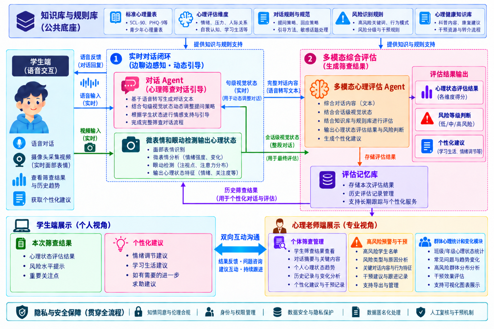

# 产品范围：学生端、医生/心理老师端与三人协作

本文件根据项目示意图整理功能边界。图展示的是**目标系统**；当前仓库的 v0.1 是它的工程骨架。下表明确区分“已实现”“有接口”和“待开发”，供三位成员排任务和联调使用。



## 1. 目标流程与负责人

```text
学生端（C）
  ├─ 文字/语音输入 ──> 对话引导与心理知识（A）
  └─ 摄像头/音频状态 ──> 多模态分析与融合（B）
                           ↓
                 初步状态与风险提示（A + B）
                           ↓
           会话/评估数据管理与双端展示（C）
                           ↓
             医生/心理老师人工查看与反馈（C）
```

A 负责下一轮提问、Mock/真实 LLM 接口、检索知识、初步风险规则；B 负责视觉、音频状态和融合结果；C 负责学生端、专业端、Session 与用户数据的存取和展示。跨模块数据格式以 `backend/models/` 和 `docs/api_spec.md` 为准，任何一人都不能单独改掉别人依赖的字段。

## 2. 图中功能与当前仓库对应关系

| 图中模块 | 当前状态 | 对应代码 / 下一步 | 负责人 |
| --- | --- | --- | --- |
| 学生实时对话 | **已实现文字版** | `frontend/src/App.jsx`、`POST /api/chat`；语音交互待开发 | A + C |
| 动态提问与对话规则 | **已接入决策模型** | `backend/policy/` 每轮选出 11 个动作之一，`DialogueManager` 只做危机干预与话术执行；无规则回退 | A |
| 心理健康知识与规则库 | **演示片段** | `backend/rag/knowledge/demo_knowledge.md`、关键词检索；量表/规范/资源需审核后引入 | A |
| 摄像头、表情、VA | **可选真实模型** | 学生端低频上传压缩帧到 `POST /api/vision/frame`；默认 Mock，可切换 EmotiEffLib | B |
| 麦克风、语音转写、语音反馈 | **仅结构化接口** | `POST /api/audio` 保存 AudioState；尚无录音、STT、TTS | B + C |
| 多模态综合评估 | **融合占位** | `fuse()` 当前只汇总可用性；真实综合模型待开发 | B，A 确认风险使用方式 |
| 心理状态分值与风险等级 | **仅规则式风险提示** | `RiskResult`、`risk_engine.py`；无标准量表计分或临床判定 | A |
| 个性化建议 | **固定演示文案** | Mock LLM 模板；建议规则和知识来源待设计 | A + C |
| 学生本次结果/历史趋势 | **未实现** | 当前页面只显示回合数、阶段、风险；需结果数据契约和历史接口 | C |
| 专业端个体管理/风险预警/群体统计 | **未实现** | 先用合成数据规划页面，再设计身份、授权、聚合与人工复核 | C，A 提供结果语义 |
| 学生与专业端双向沟通 | **未实现** | 先定义消息归属和人工回复流程，不复用 AI 消息冒充专业回复 | C |
| 评估记录库、用户数据 | **仅内存 Session** | `SessionManager`；无账号、数据库、长期历史 | C |
| 隐私、安全、知情同意 | **尚无产品流程** | 设计后才能接入真实学生资料和专业端跨用户查看 | C，三人共同审核 |

图中提到的 SCL-90、PHQ-9 等标准量表目前**没有接入、计分或验证**。若以后加入，先确认使用场景、来源、授权、计分规则和人工复核方式。

## 3. 双前端的页面边界

### 学生端

当前入口：`frontend/` 中的 React 页面。已具备创建 Session、文字聊天、查看当前会话 ID、回合数、阶段和风险等级。

后续页面按这个顺序建设：

1. **对话页**：文字先行；语音/摄像头按钮在接入 B 的真实能力后出现，并明确是否采集。
2. **本次结果页**：显示初步状态、风险提示、关注点和建议；区分机器生成与人工审核；不能写成诊断。
3. **历史页**：按学生自己的会话展示时间和趋势；需要持久化及身份关联后才能提供跨重启历史。
4. **求助与反馈入口**：明确何时转接专业人员、谁能看到内容，以及紧急情况如何联系现实中的支持资源。

### 医生/心理老师端（专业端）

当前没有页面。建议与学生端使用同一 React/Vite 仓库、分开路由或入口，避免复制一套 API 逻辑。先用合成数据做以下页面骨架：

1. **个体筛查管理**：查看已授权学生的筛查摘要、关键对话片段和历史变化。
2. **风险预警与人工跟进**：显示风险提示、原因、人工复核状态和跟进记录。规则提示本身不自动触发医疗结论。
3. **群体概览**：展示脱敏聚合趋势；小样本、可识别群体不展示明细。
4. **双向沟通**：专业人员向学生反馈、回答问题；专业回复与 AI 回复分别标识。

在账号与权限未完成前，专业端不得通过已知 `session_id` 浏览其他学生的真实对话。学生端和专业端的名称、路由、角色权限、页面字段由 C 在实现前写入文档并与 A/B 核对。

## 4. 用户数据契约

**当前真实存在的数据**是 `SessionState`：`session_id`、`conversation_history`、`turn_count`、`current_stage`、`latest_vision_state`、`latest_audio_state`、`latest_risk`、`created_at`、`updated_at`。仅存于后端单进程内存；重启消失。`session_id` 不能当学生身份或医生授权凭据。

下一阶段建议先在文档中设计以下记录，再选存储方式：

| 记录 | 最少要说明的字段 | 生成/维护者 |
| --- | --- | --- |
| 学生身份引用与同意记录 | 匿名或假名 ID、同意范围、时间、撤回方式 | C |
| 会话记录 | 会话归属、消息、时间、模态状态、删除规则 | C；A/B 提供内容 |
| 初步评估快照 | 对应会话、生成时间、各维度状态、风险提示、建议、生成方式 | A 定义语义，B 提供特征，C 存储展示 |
| 人工复核与反馈 | 评估引用、专业人员身份、复核状态、回复和时间 | C；专业端用户维护 |

这只是字段规划，**仓库尚无这些新模型或 API**。对真实数据的保存期限、访问日志、脱敏和删除流程须在接入前确定。

## 5. 下一交付的最小任务清单

- **A 对话**：维护决策模型的动作契约（11 个动作 → 本地话术）与危机优先级；给 C 一份结果字段草案，给 B 一份会用到的多模态字段清单。对话没有自动结束信号，最终评估由 `/api/assessment` 显式触发。
- **B 多模态**：写清 VisionState/AudioState 每个字段的范围、来源和缺失值；使用 Mock 状态验证 Vision/Audio → Session → Chat 的链路，真实模型可后接。
- **C 双端与数据**：保留当前学生聊天页；设计专业端路由和合成数据页面；起草学生身份、评估快照、权限及结果展示契约。未完成身份与授权前不接真实学生记录。
- **三人联合联调**：用合成会话检查两个前端的字段一致性、无模态降级、错误 Session、风险提示显示和人工回复标识。

本轮先搭**清楚、可替换、可测试**的开发框架。真实识别准确率、临床效果、漂亮 UI 和复杂权限系统不作为当前 v0.1 的完成标准。
